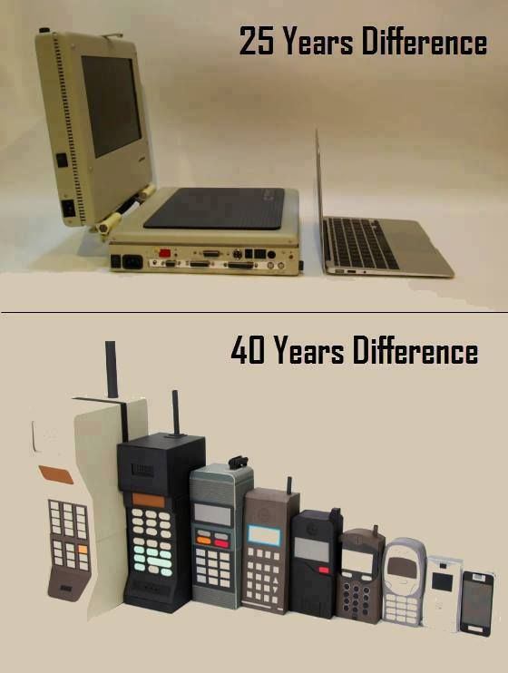
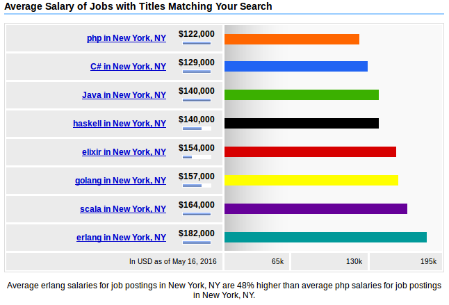

# Prediciendo el futuro

!SLIDE

# Aprendamos a predecir el futuro.
## by Alejandro García F
## CIMAT - Zacatecas
@elviejo79

!SLIDE center
# O... el privilegio de estudiar en el

}}} images/itszn.jpg

!SLIDE bottom-right

# 1996: cuando entré a estudiar en la carrera

}}} images/monitor-tos-shine-theparadisesyndrome.jpg

!SLIDE dark

# ...nos enseñaron

!SLIDE

# otra cosa importante pasó en 1996

}}} images/box-wave-duke-small.png

!NOTES
Java 1.0 salío a producción en Enero de 1996

!SLIDE

# Por qué no me enseñaron Java?
}}} images/James_Gosling_2005.jpg::goto.com::cr::http:://gotocon.com/dl/2010/Web/James%20Gosling%20interview.jpg

!SLIDE left

### En 1996 no había empleos programando en Java
### Es normal que como aprendimos, enseñemos
### Renovar el plan de estudios se lleva al menos 5 años
### Adaptarse a una nueva herramiento toma aprox. 5 años
### Toma 25 años, adoptar un nuevo paradigma (procedural vs OOP)

!SLIDE top-left

# Cuál es Pascal de tu generación?
}}} images/NiklausWirth-BW.jpg::quotesgram.com::(c)::http:://quotesgram.com/niklaus-wirth-quotes/

!SLIDE

# Java

!SLIDE

# Cómo será el futuro?
}}} images/Alan-kay.jpg::thepositiveencourager.global::(c)::http://www.thepositiveencourager.global/alan-kay-on-creativity-3/

!SLIDE

> "The best way to predict the future is to invent it"
> (Alan Kay)
> [Alto](https://youtu.be/AnrlSqtpOkw?t=4m2s)

!SLIDE bottom-left

# Qué dice la ley de moore?

}}} images/gordon_moore_intel.png::nag.co.za::(c)::http://www.nag.co.za/2015/04/20/moores-law-is-now-over-50-years-old-today/

!SLIDE

!NOTE
The quantity of transistors we can fit in a single chip doubles every month.

!SLIDE
# Es que actualmente

!SLIDE

# Esto siginifica

* Si hoy estśa en primer semestre tu computadora de $1000 usd tiene 8 procesadores...
* para cuando te gradúes tendrá 8 * 2 * 2 = 32

!SLIDE

* Si hoy un servidor de $10,000 usd tiene 48 cores
* para cuando te gradúes tendrá 48 * 2 * 2 = 192

!SLIDE

# entocen para predecir el futuro sólo se necesita...

!SLIDE bottom-left

#extrapolar

}}} images/moose-brain.png

!SLIDE
Incluso podemos comprar la computadora del futuro hoy!
Sólo es cuestion de cambiar tiempo por dinero.

!SLIDE
# Es que actualmente

!SLIDE

# Podemos predecir que en el futuro las computadoras serán más rapidas y con más procesadores
# duuhh!

!SLIDE

# En qué se usarán tantos procesadores?

# Microsoft Holo Lens
[Video](https://youtu.be/29xnzxgCx6I?t=45s)

!SLIDE

# She Película - Inteligencia artificial

}}} images/her.jpg

!SLIDE

# Robots I Robot
}}} images/IRobot.jpg

!SLIDE bottom-right

# Cómo lo vas a programar?
> "The way the processor industry is going, is to add more and more cores, but nobody knows how to program those things. I mean, two, yeah; four, not really; eight, forget it." (steve jobs)

}}} images/jobs.jpg

!SLIDE

# Es necesario otro paradigma de programación,

}}} images/internet.jpg

!SLIDE

# El futuro es: funcional y concurrente.

!SLIDE

* Java -&gt; Scala.
* Ruby -&gt; Elixir,
* C -&gt; GoLang,
* C++ -&gt; Rust

* haskell y elm

!SLIDE

# y por ello es un privelegio estudiar aquí.

!SLIDE

# Cuántas escuelas en México creen que impartan estas materias?

!SLIDE

!SLIDE

!SLIDE

!SLIDE

!SLIDE

!SLIDE

}}} images/functional_is_comming.jpg
[salary comparision](http://www.indeed.com/salary?q1=php&l1=Los+Angeles&q2=java&l2=Los+Angeles&q3=C+sharp&l3=Los+Angeles&q4=scala&l4=Los+Angeles&q5=erlang&l5=Los+Angeles&q6=haskell&l6=Los+Angeles&q7=elixir&l7=Los+Angeles&tm=1)

!SLIDE

}}} images/becoming-teacher.jpg
