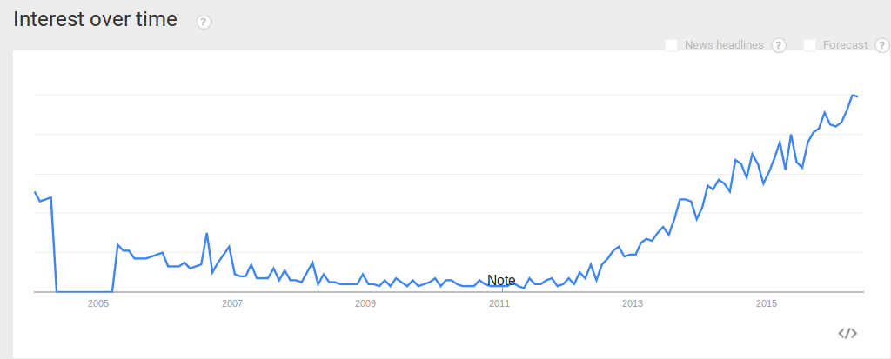

# 5e5:
## Entrenar 5000 datascientist en 5 años
---
# PROPUESTA
## Cómo podemos Entrenar 5000 data scientist en 5 años ?
___
# PERO:
## Vale la pena entrenar 5000 data scientists?
es decir Big Data está dentro del Hype Cycle

___
## Gartner puso Big Data en de caida en el 2014 *

* Gartner: Hype Cycle for Emerging Technologies, 2014
___
# FACT:
> McKinsey [2011]predicts that by 2018 the number of data science jobs in the United States alone will exceed 490,000, but there will be fewer than 200,000 available data scientists to fill these positions. Globally, demand for data scientists is projected to exceed supply by more than 50 percent by 2018.

[McKinsey, 2011] McKinsey Global Institute: "Big data: The next frontier for innovation, competition, and productivity" 2011
___
# SOL:
Sí vale la pena entrenar DS que entregen resultados reales más allá del hype.

---
# PROPUESTA
Dado que:
* Sí vale la pena entrenar DS que entregen resultados reales más allá del hype.

Cómo
* podemos entrenar 5000 DS en 5 años
___
PERO:
Qué te dice que existen 5000 personas interesadas en ser DS?
___
FACT:
El interés en big data sigue en aumento en méxico y el mundo.

___
SOL:
Podemos esperar que el interés en DS siga creciendo en méxico y el PROPUESTA.
----
# PROPUESTA
Dado que:
* Sí vale la pena entrenar DS que entregen resultados reales más allá del hype.
* Podemos esperar que el interés en DS siga creciendo en méxico y el PROPUESTA.
Como podemos entrenar 5000 DS en 5 años?
----
PERO: Existen en méxico 5000 personas / estudiantes con las habilidad necesaria y el interés de convertirse en data scientist?
___

# FACT:
* No es TAN difícil ser DS, sólo se requiere:
  * Algebra Lineal
  * Estadística Análitica y Predictiva. (Poisson, Whirbul, etc.)
  * Saber programar (no estamos impresionados con el nivel de programación de los DS)
  * Es decir muchos estudiantes de ingeniería, economía, epidemiología cuentan  con los fundamentos.
___
# FACT
* En México se graduaron 118 mil ingenieros en el ciclo escolar 2012-2013, [manufactura.mx]
* El 20% de los estudiantes de licenciatura ingresan a una maestría. (y el 19% de esos tienen una beca Conacyt) [universia, 2011]
* El 86% de los DS tiene Maestría o superior. (es causa o efecto?)

___
# SOL:
100k est-ing-año ** 20% maestría = 20k est-mae-año * 5 años = 100k maestros en ingeniería en los próximos 5 años.
con que 1 de cada 20, quiera ser data scientist.
es decir
*sólo el 1% de los estudiantes anuales de ingeniería quiera ser DS.

------------------------------------
# PROPUESTA
Dado que:
* Sí vale la pena entrenar DS que entregen resultados reales más allá del hype.
* Podemos esperar que el interés en DS siga creciendo en méxico y el PROPUESTA.
* Sólo necesitamos que el 1% de los estudiantes de ingeniería quiera ser DS
Como
*podemos entrenar 5000 DS en 5 años?*
---
# PROPUESTA
un maestría en línea (MOOC) de DS
___
# PERO
eso ya se ha hecho muchas veces
___
# SOL
si pero sin el expertise de CIMAT en Estadística y Desarrollo de Software.
---------------------------------
# PROPUESTA
Dado que es Valioso
Cómo podemos entrenar 5000 DS?
Con maestría en línea (MOOC) de DS que
* Tenga el prestigio de CIMAT
___
# PERO
Una maestría lleva mucho tiempo y las necesidades son inmediatas.
___
# FACT
* En europa los masters toman un año
* El MIT tiene su [MicroMaster + Blended Master](http://scm.mit.edu/program/blended-masters-degree-supply-chain-management)
---------------------------------
# PROPUESTA
Dado que es Valioso,
Cómo podemos entrenar 5000 DS
* Con un MOOC
* Con Maestría con el prestigio de CIMAT
* Que utilice el formato de MicroMaster + Blended Master como el MIT
___
# PERO
Los MOOCS tienen un bajísimo nivel de terminación.
# FACT
* Un estudiante que pasa la tercera semana del MOOC, tiene un 80% de posibilidades de terminarlo.
* Para asegurarnos de que lo pase hay dos maneras:
  * Un ambiente controlado (clases)
  * Un grupo de  estudio en persona (MeetUP)
  * o virtual
---------------------------------
# PROPUESTA
Dado que es valioso
Cómo podemos entrenar 5000 DS
* con un MOOC
* con el prestigio de CIMAT
* con un micromaster http://scm.mit.edu/program/blended-masters-degree-supply-chain-management)
* que fomente los grupos de estudio, en persona
___
# PERO
