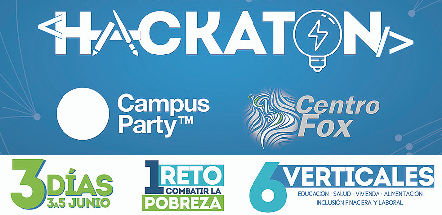
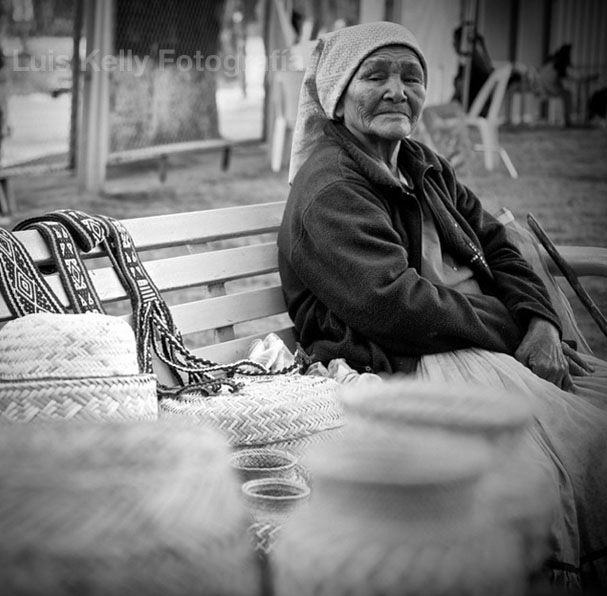
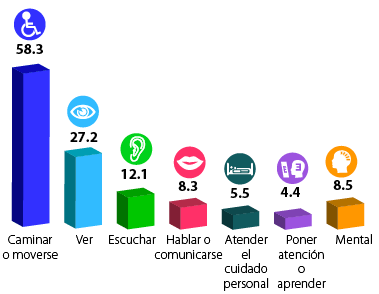
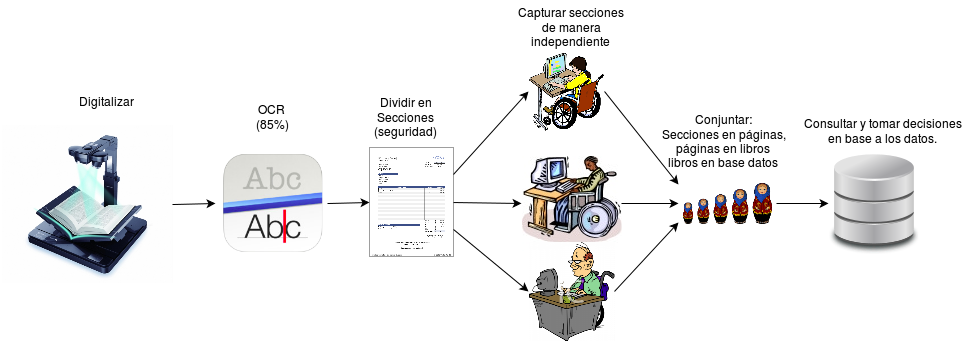
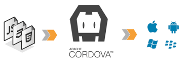

# 1Reto

---

# La persona más pobre de México
> Una mujer con discapacidad, anciana e indígena.

---
# Impacto: La discapacidad en méxico
* [5 millones 739 mil 270, (5.1%)](http://cuentame.inegi.org.mx/poblacion/discapacidad.aspx?tema=P)
* Desempleo del 90% ( [población en gral. 4.1%](http://www.noticiasmvs.com/#!/noticias/tasa-de-desempleo-en-mexico-baja-a-41-en-enero-de-2016-ocde-348) )

---

# Capturista sobre ruedas
  Generar *empleo* para personas con *discapacidad* a través del *teletrabajo*.

---
# Cómo lo hacemos?

---

# Demo
##FrontEnd

##BackEnd

---
# Viabilidad
* Softlogik.mx (2011): Emplea a 60 capturistas presenciales

> Su director se comprometió a contratar a los Capturistas Sobre ruedas! :D
---
# GRACIAS

---
# Cómo nos puedes ayudar?

* Si tienes necesidades de digitalización, contrata a SoftLogiK.mx
* Si tienes una empresa de digitalización, contrata a nuestros capturistas
* Si tienes trabajos remotos, platiquemos
* Si eres VC, pues invierte en nosotros para poder trabajar en esto de tiempo completo.
* Si eres developer, clona nuestro repo en github y ayúdanos a trabajar.
---
# Preguntas frequentes:
* Una persona pobre no tiene Internet ni celular.
* Y la seguridad de la información? (VPN, secciones )
* Por qué Software Libre? (acercar el empleo)
